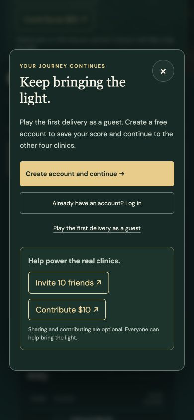
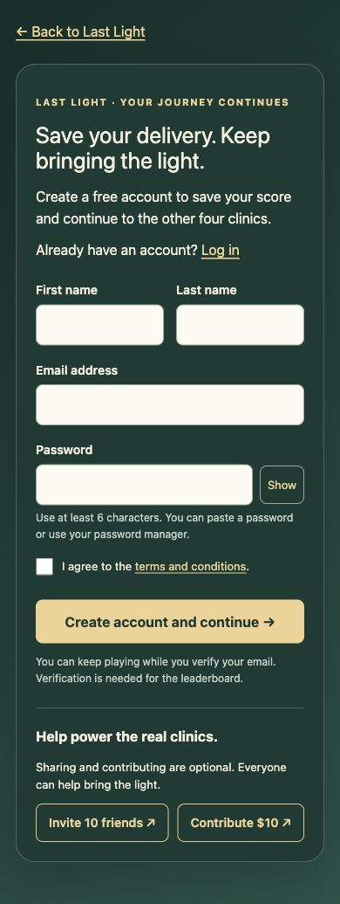

# Last Light: first guest delivery and account conversion

Implemented locally on October 1, 2026. Hosting and Firebase Functions need to be released together; nothing was deployed during this task.

Guests can retry and replay the first clinic. Before starting, the landing page explains that a free account is required to save the score and continue to the other four clinics. The first completion retains the celebration and score, then offers account creation, existing-account login, and replay. The same access policy covers map selection, challenges, new starts, practice, return checkpoints, and saved journeys. New server tickets for later clinics require authentication. Authorization failures cannot become offline tickets. Authentication loading or failure is never interpreted as a guest session.

The game signup form requires first name, last name, email, password, and acceptance of the existing terms. It accepts international and one-character names, supports password managers and password visibility, and has inline validation and duplicate-submit protection. Normal site signup retains its existing flow. Game accounts return without waiting for email verification; new public rankings require verification. Profile writes have a bounded wait and can be recovered using the same credentials. Email-delivery failure does not report a successful account creation as failed. The verification page offers resend and continuing to play.

Guest history remains until authenticated synchronization succeeds. Retry preserves each attempt and the better existing score. An existing unfinished account journey is retained, with an explicit choice to use the guest journey instead. That choice survives refresh and can be reopened. Completed result handoffs restore the scene; unfinished drives return to the map with their active checkpoint available under Continue journey.

Invite 10 friends and Contribute $10 are visible to guests and members on the landing page, account gate, completion screen, and game signup. They remain optional. Donation links carry amount=10 and the selected language. Sharing retains the existing score-specific copy and driving image, and excludes private return IDs.

## Verification

- 281 Last Light tests passed, including access policy, durable conversion, failed sync and retry, account journey conflict, authorization rejection, completion actions, and gameplay regressions.
- 13 focused Angular auth tests passed: four-field rendering, international names, immediate signup, inline validation, duplicate submit, failed-profile recovery, bounded profile/email waits, proof of account ownership, and scoped unverified returns.
- 15 backend unit tests and 5 isolated Firebase emulator integration tests passed. The emulator run used the installed Java 25 runtime and the demo-last-light project, with no real accounts or emails created.
- The optimized site build and hosting isolation checks passed for Angular and both games.
- Browser checks covered English and French signup handoff, password visibility, inline validation, guest chapter gating, and 390-pixel mobile layouts without horizontal overflow. The isolated completion fixture verified score celebration, account/login/replay CTAs, both ways to help, and the share preview with the actual fixture score.

The development fixture supports `qa/clinic-story.html?scene=closing&id=0&account=guest` (also `unverified` and `verified`) without writing game progress.

