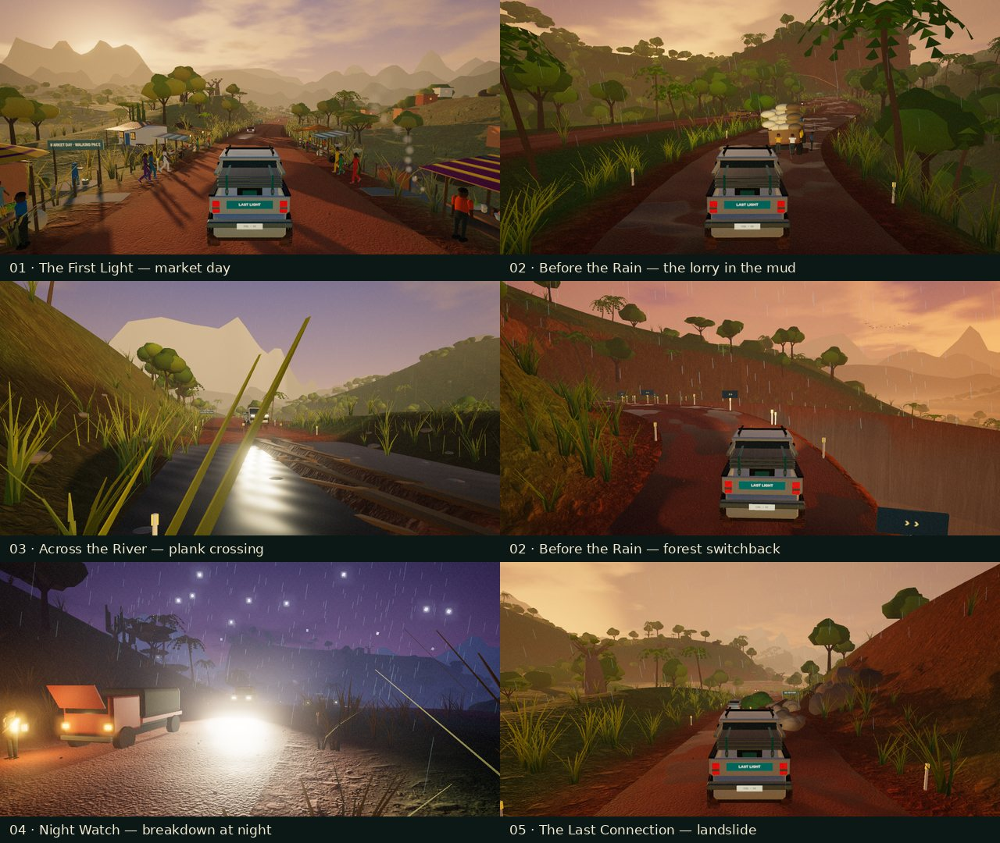

# Last Light: five places verification

Before this change, every chapter drove the same road. All five used one lateral curve and one vertical profile. The washout, the hairpin at 365 m, the bridge or minibus around 525 m and the flood or herd around 850 m always came in the same order. Revision 6 gives each chapter its own place, its own road and a signature moment. The whole implementation lands in one pass.

## Design

**Each chapter is a place.** The mission data now holds the road's shape (sine components), its half-width, rolling hills, overall climb, an optional basin (the river valley), its switchbacks, the cliff depth and the far vistas (`vista.drop / rise / roll`).

| Chapter | Landscape | Road | Signature moment |
| --- | --- | --- | --- |
| The First Light | Open savanna valley | Wide (5.2 m half-width), long sweeps, descends into the valley, no switchback | Market day: stalls with wax-print awnings and parasols, vendors and shoppers, villagers crossing between the stalls |
| Before the Rain | Rain forest | Narrow (4.4 m), winding (55 m bends), dense trees close to the road, one switchback | Rain arrives mid-drive; a lorry bogged in the mud on the short route |
| Across the River | River country | Follows a river down to the crossing, then climbs out | A creek crossed on two timber runners; the river passes under the damaged bridge |
| Night Watch | Highland escarpment | Climbs 25 m, tight bends, twin switchbacks, 82 m cliffs | A broken-down truck at night, marked with leafy branches |
| The Last Connection | Storm country | Every kind of road, with the storm thickening | A fresh landslide across half the road |

**Pacing.** Moments are authored per chapter, not placed on a fixed beat. Each chapter opens quietly, with the first moment 205–250 m in. Gaps between moments range from 140 m to 410 m, so tension builds and releases.

**Warn, choose, consequence.** Every new moment has a sign well ahead, an on-screen warning at 145 m, a choice (a detour, or the marked line) and a physical consequence:

- **Market:** people cross only while the market is calm. A truck above 20 km/h within 80 m, or traffic in the market, sends them to the verge. Nobody steps out in front of a truck moving up to their lane. A clean pass means under 18 km/h.
- **Lorry:** a solid body stands in the closed half of the road, with the mud band around it. A clean pass needs the firm side and under 30 km/h. A signed detour avoids it.
- **Plank crossing:** the creek is carved into the terrain the truck drives on. The runners stay at deck level, and between and outside them the ground drops 0.55 m. The runners have a wood surface; the creek bed is slow and loose. A clean pass needs both front wheels on the runners and under 13 km/h. A signed detour avoids it.
- **Breakdown:** a solid truck with its bonnet up, hazards flashing and branches on the road 24 and 42 m before it. A clean pass needs the open side and under 40 km/h. The fork offers a firmer road around it.
- **Landslide:** the debris is terrain. The mound rises to about 1.5 m on the closed side, the boulders are colliders, and a passage of about 4 m stays open. A clean pass needs the marked passage and under 25 km/h.

**Weather that changes.** `rainStart` lets rain arrive during the drive: the forest goes from dry to 0.8, and the storm finale from 0.55 to 1. Grip, surface wetness, road puddles, rain streaks, fog, wipers, rain audio, the headlight mode and the warning distance all follow the rain where the truck is.

**The river.** It has its own channel: a bed below the water and banks just above it. It never touches either drivable corridor. It passes under the bridge and bends away before the switchback. The water surface falls gently downstream.

**Fresh tracks.** The second road edition puts the damage on the other side for washouts, floods, trees, lorries, breakdowns, landslides and herds. Oncoming traffic always keeps to its own side.

**Traffic.** Traffic follows the same rules as the player. It crawls through the market and goes single file only right beside a blocker, so waiting cars stay in their own lane. It takes the signed bypasses, and it yields before each switchback in turn.

## Engineering changes

- `routes.ts`: the radius-preserving switchback bend now composes over any number of pivots. The discs never overlap, so the inverse stays exact. `ridgeAt`, `ridgeElevation` and road width compensation apply per pivot.
- `road-sections.ts`: authored sections per chapter, plus one switchback section per pivot. It adds the landslide mound (`slideHeight`), the creek and runners (`onPlank`, `creekAt`) and the list of blockers.
- `set-pieces.ts` and `set-piece-art.ts` hold one deterministic layout, used by both physics and art, for stalls, walkers, rocks, runners and parked vehicles, plus the art for all five moments.
- `missions.ts`: per-chapter geography, `rainAt`, `riverX` / `riverLevel` / `riverSpan` and the river banks.
- `scenery-layout.ts`, `village.ts`: villages per chapter, homes moved off river banks, set-piece clearings, forest density, and signs per switchback and moment.
- `qa-driver.ts`: passing lines for the new moments. The QA pilot now considers only hazards on its own route. It no longer overtakes where a bypass splits or rejoins, never cuts in beside a car after an abandoned overtake, and follows lead cars on switchbacks.
- `ROAD_REVISION` is 6. Revision 5 records remain valid and separate.

## Checks run

| Check | Result |
| --- | --- |
| `npm test` (games/last-light) | 145/145 pass: the 125 existing tests plus 20 new (`tests/places.test.ts`) |
| Existing tests updated for per-chapter layouts | Switchback tests now cover every pivot of every chapter. Minibus and oncoming-vehicle tests use the river chapter. The mud-boundary test reads the chapter's mud band. The minibus clean-pass test holds the centre line. |
| New tests | Distinct places and signatures; nothing authored on a switchback; rain arrives and grip falls; revision 5 records kept; market stalls clear of the road; the crowd waits for a hurrying truck; walking pace is clean and hurrying is not; runners at deck level over a real creek; a straight, slow plank crossing is clean, while wheels off the runners or rushing are not; the lorry, breakdown and landslide are solid on the closed side and clean on the marked side; the landslide flips with fresh tracks; single-file traffic only beside a blocker; the river never touches the deck and runs under the bridge |
| QA pilot sweep (Node, outside the suite) | 40/40 deliveries: 5 chapters × 2 editions × 2 routes × 2 paces. Every encounter clean, integrity 100. Tightest reserve: 44 s of 300 (chapter 5, ordinary pace). |
| `tsc --noEmit` | clean |
| `npm run build` | passes. JS 1,047 KiB gzip (baseline 1,039). Total 24.46 MiB (baseline 24.43). No QA strings in production JS. |
| Physics cost (600 steps, Node) | 0.19–0.47 ms per step, against a baseline of 0.14–0.54 ms. Engine build +250–300 ms per chapter. |
| Screenshots | Every chapter at its signature moment and at several stations, rendered in headless Chromium with SwiftShader at 960×540 |

## Known limits

- **Draw calls near the market.** SwiftShader counts about 800 calls there (shadow passes included) against 300–700 elsewhere, mostly the skinned figures. Standing figures are frustum-culled, and the crowd is hidden more than 260 m away. Frame rate on a real GPU was not measured here. Check the `?qa=1` panel at the market on the target Mac.
- **Villagers are art, not physics.** Their behaviour keeps them out of the truck's path, but they are not colliders.
- **River shape.** The river is a carved channel with a single water ribbon. From the air it reads as a gentle meander rather than a braided river.
