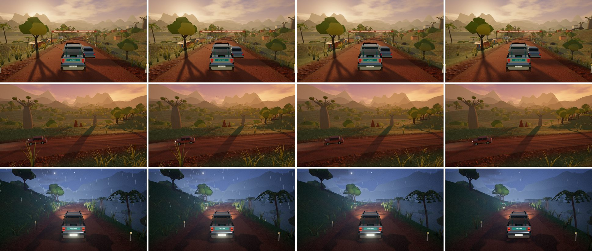

# Last Light: optimisation verification

Revision 7 makes Last Light quick to load on slow or metered connections and smooth on older phones, while High keeps the same look. No gameplay, physics or art direction changed.

*Left to right: before revision 7 (High), High, Balanced, Light. Rows: the market approach in chapter 1, the savanna vista, and the storm finale at night. Rendered in headless Chromium (SwiftShader) at 960×540.*

## Downloads

| | Before | After |
| --- | --- | --- |
| Opening the page to the first drive | ≈ 11 MB | ≈ 1.7 MB |
| Menu art | 2.51 MB PNG | 79 KB (small screens) / 212 KB WebP |
| Compressed code (JS + CSS) | 1,047 KiB, Rapier inlined as base64 | 348 KiB, plus a 523 KiB gzip `.wasm` streamed and compiled while it downloads |
| Road and ground textures | 6.21 MB (five JPGs and an unused HDR sky) | 350 KB WebP base set; the 854 KB sharper set loads only on fast connections, three seconds into the drive |
| Staff and villagers model | 826 KB | 309 KB (meshopt) |
| Clinic compound | 322–460 KB GLB per chapter | none: built from the same code at runtime |
| Music | 192 kbps originals | 96 kbps copies unless the connection reports fast, unmetered 4G |
| Story narration | ten clips, stereo | ten clips, 56 kbps mono (79–133 KB each) |
| Whole package | 24.46 MiB | 16.49 MiB |

Spending a few seconds on the menu prefetches the drive's code, physics and surfaces, unless data saver is on. After the first visit, a service worker serves the game's files from cache. Its cache is keyed to a hash of the build, and it passes audio range requests straight to the network.

## Rendering

| Measure (SwiftShader, chapter 2 unless noted) | Before | After |
| --- | --- | --- |
| Start to first drivable frame | 13.3 s | 6.0 s |
| Shader programs | 74, rising during the drive | 48, unchanged across a whole-route sweep |
| Draw calls at the market (chapter 1) | 911 | 598 |
| Skinned-mesh draw calls at the market | 371 | 58 |
| Draw calls, comparison views (High) | 845 / 335 / 292 / 495 | 526 / 200 / 284 / 286 |
| Engine build time in Node | 711–1,105 ms | 470–620 ms |

The same views on each tier:

| View | Before (High) | High | Balanced | Light |
| --- | --- | --- | --- | --- |
| Market approach | 845 calls, 2.04 M tris | 526, 1.96 M | 521, 1.70 M | 463, 1.23 M |
| Savanna vista | 335, 1.34 M | 200, 1.23 M | 195, 1.00 M | 181, 0.74 M |
| River climb | 292, 1.82 M | 284, 1.77 M | 235, 1.11 M | 220, 0.87 M |
| Storm finale | 495, 1.56 M | 286, 1.52 M | 224, 1.01 M | 210, 0.81 M |

These changes lower the cost of a frame:

- **Warm-up.** Shaders are compiled before the drive against the post-processing target they draw to, which removes a duplicate screen-space set.
- **One light for oncoming traffic.** Vehicle beams share one pooled spotlight, so the scene's light count never changes. A change in light count triggers shader recompiles.
- **Merged characters.** Each person is one skinned draw call with vertex colours and a shared material, and is culled when off-screen.
- **Cached road maths.** Road-shape lookups (centre line, height, fork, ridge, width, deck, branch sections) are cached per station.

High matches the previous look: the mean per-pixel difference in the comparison views is 3–6 of 255. That difference comes from rain placement and frame timing, not from any change in materials.

## Tiers

| | Light | Balanced | High |
| --- | --- | --- | --- |
| Pixel ratio cap | 1 | 1.25 | 1.5 |
| Anti-aliasing | FXAA | FXAA | 4× MSAA |
| Sun shafts and bloom | off | on | on |
| Shadow map | 1024 | 1536 | 2048 |
| Terrain and headlight shadows | off | off | on |
| Grass / hills / pebbles | 2,200 / 1,400 / 600 | 3,800 / 2,500 / 1,100 | 5,200 / 3,200 / 1,500 |

Auto picks a starting tier:

- A software or low-end GPU, 2 GB of memory or less, or two cores or fewer starts on Light.
- A capable phone GPU with at least 4 GB starts on Balanced; other touch devices start on Light.
- Integrated graphics, 4 GB or less, or four cores or fewer starts on Balanced.
- Everything else starts on High.

The frame governor then samples the slow end (p90) of frame times every 1.5 s. When frames run over 27 ms, it lowers resolution in steps down to 60 %, then drops one tier. When frames stay under 18.5 ms, it restores resolution. It never raises the tier during a drive. Choosing High, Balanced or Light explicitly fixes both the tier and the resolution.

## Checks

- `npx tsc --noEmit`: clean.
- `npx vitest run`: 12 files, 152 tests pass. The new `tests/performance.test.ts` covers asset sizes and removals, connection-based music selection, the service worker source, tier detection, tier ordering, governor behaviour and the correctness of the road-maths cache.
- Pilot sweep: all five chapters, both road editions, both routes (20 drives) deliver on time with full cargo condition and every authored moment passed.
- The production build loads, compiles the streamed physics module and starts a drive under `vite preview`; the development server does the same.
- Draw-call and program counts were collected from the running game. The screenshots above are from the development server.

## Limits

SwiftShader cannot measure real GPU frame times. The tier thresholds and governor limits are informed estimates and should be confirmed on real low-end Android phones, iOS devices and integrated-graphics laptops. The Network Information API is unavailable in Safari and Firefox. There, music uses the lighter copies, and sharper textures load only on devices with a fine pointer (desktops).
